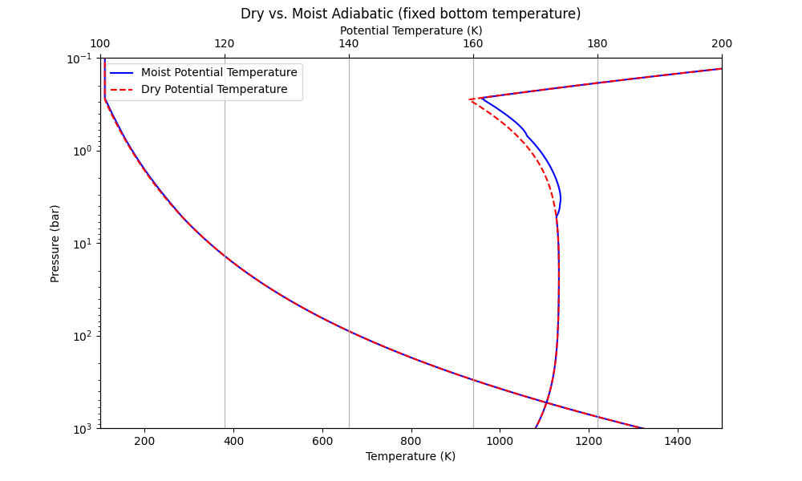

# A  python demo to run JunoMWR forward RT using Canoe

## Install and compile

Clone to local directory and check into branch `jh/juno_mwr_fwd`:
```bash
local $ git clone https://github.com/jihenghu/canoe.git
local $ cd canoe
local/canoe $ git checkout jh/juno_mwr_fwd
local/canoe $ cd ..

```

make a build path and compile:
```bash
local $ mkdir build
local $ cd build
local/build $ cmake ../canoe -DTASK=juno
......

local/build $ make -j8
```

## Demos
There are three main demo files under `build/bin/`:
### `run_juno_forward_mwr.py`
A simplest demo, run RT in Jovian Equtorial Zone, with:
- `moist adiabatic` model, with a fixed 1-bar temperature;
- `constant NH3 abundace` which only constrained by the saturation;
- parameters are taken from [Cheng (2020)](https://www.nature.com/articles/s41550-020-1009-3);
- key configurations are specfied in `juno_mwr.yaml` and `juno_mwr.inp`.
- output profiles of NH3, H2O and Temperature;
- as well as radiances:
	

#### outouts
You can output the vars wanted using H5PY, like:
```python 
# Save the results to an HDF5 file
with h5py.File('juno_mwr_fwd_case-EZ-moist-profile.h5', 'w') as h5file:
    h5file.create_dataset('SH_NH3', data=SH_NH3)
    h5file.create_dataset('RH_NH3', data=RH_NH3)
    h5file.create_dataset('NH3_ppmv', data=NH3_ppmv)
    h5file.create_dataset('temp', data=temp)
    h5file.create_dataset('theta', data=theta)
```
Or, use the Canoe in-built output portal, yeilds a `nc` format.
```python 
## -------------   use-inbuilt default output for more variables   ------------------
print(pin.set_string("job", "problem_id","juno_mwr_fwd_case-EZ-moist"))
out = Outputs(mesh, pin)
out.make_outputs(mesh, pin)
import os
os.system("./combine.py")
```

### `demo_juno_mwr_fwd_EZ_fix_T1bar.ipynb`
A test comparing the dry vs. moist adiabatic modelings, with the same T1bar.
	

### `demo_juno_mwr_fwd_EZ_fix_Ts.ipynb`
A test comparing the dry vs. moist adiabatic modelings, with the same bottom temperature.
	
		
## Use your own profiles

`run_juno_forward_overwrite_profile.py` show a demo to modify properties at given layers before running RT. Properties include `xNH3`, `xH2O`, `Temperature`, `e-`.
This is implemented via function:

```python
def overwrite_layer_properties(mb, ilayer, temp, nh3_ppmv, h2o_ppmv, electron):

    aircolumn = mb.get_aircolumn(mb.k_st, mb.j_st + Jindex, mb.i_st, mb.i_ed)  
    ap_mole = aircolumn[ilayer].to_mole_fraction()

    # set temperature, NH3, H2O
    ap_mole.set_temp(temp)
    ap_mole.set_property(iNH3, nh3_ppmv/1E6)
    ap_mole.set_property(iH2O, h2o_ppmv/1E6)

    # put back to the air column
    mb.distribute_to_primitive(mb.k_st, mb.j_st + Jindex, mb.i_st + ilayer, ap_mole)

    # set electron
    mb.set_tracer(ielec, mb.k_st, mb.j_st + Jindex, mb.i_st + ilayer, electron)  
    # mb.set_tracer(iNa, mb.k_st, mb.j_st + Jindex, mb.i_st + ilayer, pNa)  

```

A test like,

```python 
pa, nh3_ppmv, h2o_ppmv, temp, elec = 7000E5, 400, 4000, 2000, 1E16
# find the layer index for the given pressure
ilayer = np.argmin(np.abs(pressure - pa))

query_layer_properties(mb, ilayer)

# overwrite the layer properties
overwrite_layer_properties(mb, ilayer, temp, nh3_ppmv, h2o_ppmv, elec)

# check the layer properties after modification
query_layer_properties(mb, ilayer)
```

 will yields the following log in console:
 
``` bash
--------------------------  15-th Layer properties----------------------------
  P =  6996.22 bar
  T = 2171.79 K
  Θ = 158.45 K
  xNH3 = 351.00 ppmv
  xH2O = 2500.00 ppmv
  e- = 7.317530469073691e+17 m^-3
  Na+ = 9.263011667119726e+20 m^-3
--------------------------  15-th Layer properties----------------------------
  P =  6996.22 bar
  T = 2000.00 K
  Θ = 146.01 K
  xNH3 = 400.00 ppmv
  xH2O = 4000.00 ppmv
  e- = 1e+16 m^-3
  Na+ = 9.263011667119726e+20 m^-3
```


