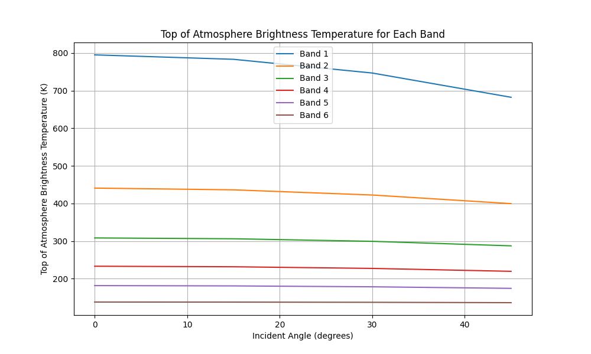
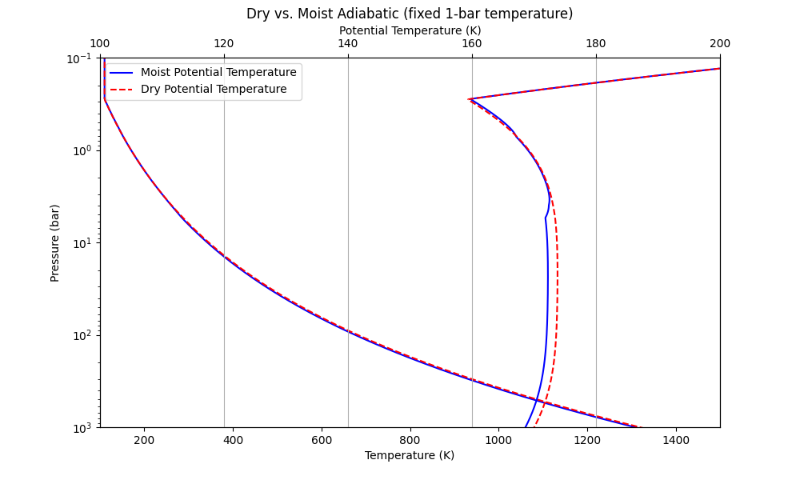

# A  python demo run JunoMWR forward RT using Canoe

## Install and compile

Clone to local directory and check into branch `jh/juno_mwr_fwd`:
```bash
local $ git clone https://github.com/jihenghu/canoe.git
local $ cd canoe
local/canoe $ git checkout jh/juno_mwr_fwd
local/canoe $ cd ..

```

make a build path and compile:
```bash
local $ mkdir build
local $ cd build
local/build $ cmake ../canoe -DTASK=juno
......

local/build $ make -j8
```

## Demos
There are three main demo files under `build/bin/`:
### `run_juno_forward_mwr.py`
A simplest demo, run RT in Jovian Equtorial Zone
- `moist adiabatic` model, with a fixed 1-bar temperature;
- `constant NH3 abundace` which only constrained by the saturation;
- parameters are taken from [Cheng (2020)](https://www.nature.com/articles/s41550-020-1009-3);
- key configurations are specfied in `juno_mwr.yaml` and `juno_mwr.inp`.
- output profiles of NH3, H2O and Temperature;
- as well as radiances:
	

#### outouts
You can output the vars wanted usign H5PY, like:
```python 
# Save the results to an HDF5 file
with h5py.File('juno_mwr_fwd_case-EZ-moist-profile.h5', 'w') as h5file:
    h5file.create_dataset('SH_NH3', data=SH_NH3)
    h5file.create_dataset('RH_NH3', data=RH_NH3)
    h5file.create_dataset('NH3_ppmv', data=NH3_ppmv)
    h5file.create_dataset('temp', data=temp)
    h5file.create_dataset('theta', data=theta)
```
Or, use the Canoe in-built output portal, yeilds a `nc` format.
```python 
## -------------   use-inbuilt default output for more variables   ------------------
print(pin.set_string("job", "problem_id","juno_mwr_fwd_case-EZ-moist"))
out = Outputs(mesh, pin)
out.make_outputs(mesh, pin)
import os
os.system("./combine.py")
```

### `demo_juno_mwr_fwd_EZ_fix_T1bar.ipynb`
A test comparing the dry vs. moist adiabatic modelings, with the same T1bar.
	

### `demo_juno_mwr_fwd_EZ_fix_Ts.ipynb`
A test comparing the dry vs. moist adiabatic modelings, with the same bottom temperature.
	
		


